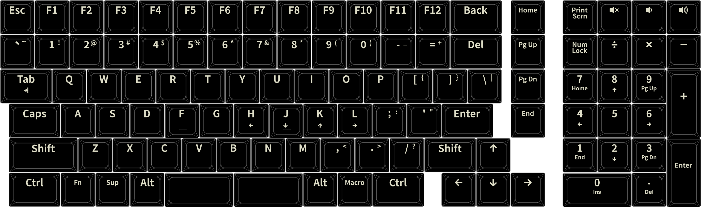
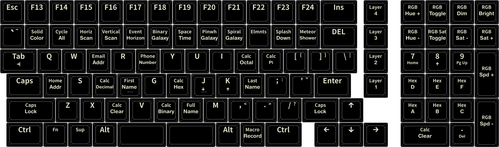
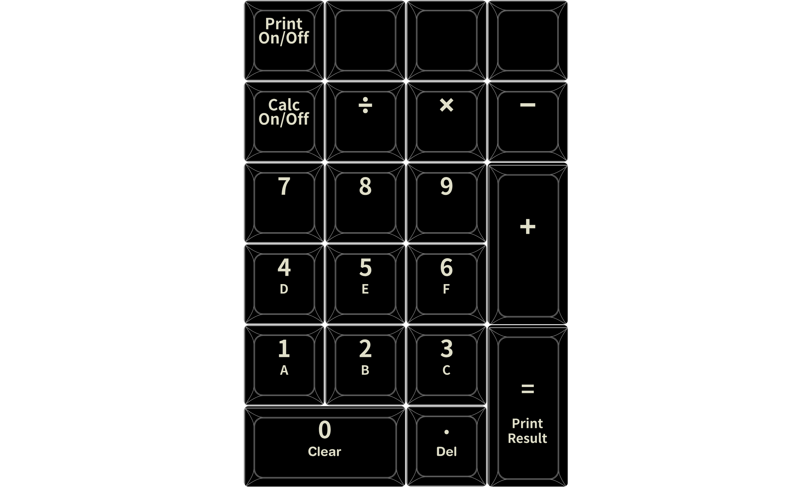

# System76 Launch Heavy 3 Custom Keymap

This is my personal keymap for the System76 Launch Heavy 3 keyboard.


Shinethrough keycaps from [FKcustom](https://fkcaps.com/custom/2S5MWD/)
## Features

- Base QWERTY layer
- Function layer with RGB effects and controls
- Numpad calculator mode

## Layers

### Layer 0: Base
- Standard QWERTY layout
- Modifier keys in ergonomic positions
- Macro play key
- Layer toggle keys
- Tap shift keys for Caps-Word
- Shift-Bcksp for Delete
- Shift-Delete for Insert

### Layer 1: Function

- F12-F24 keys
- Select RGB Effects on number row
- Adjust RGB lighting controls on num pad / media keys
- Macro record
- Static macro keys
- Calculator Binary/Octal/Decimal/Hexadecimal

### Calculator Mode

- Num-Lock to enable/disable calculator mode
- Print Screen to toggle typing/stealth input
- Results will flash on number row
- Shift-0 to clear input
- Shift-0 again to clear all
- Shift-Enter to type result

## Building

To build this keymap:

```bash
qmk compile -kb system76/launch_heavy_3 -km mkrzywonski
